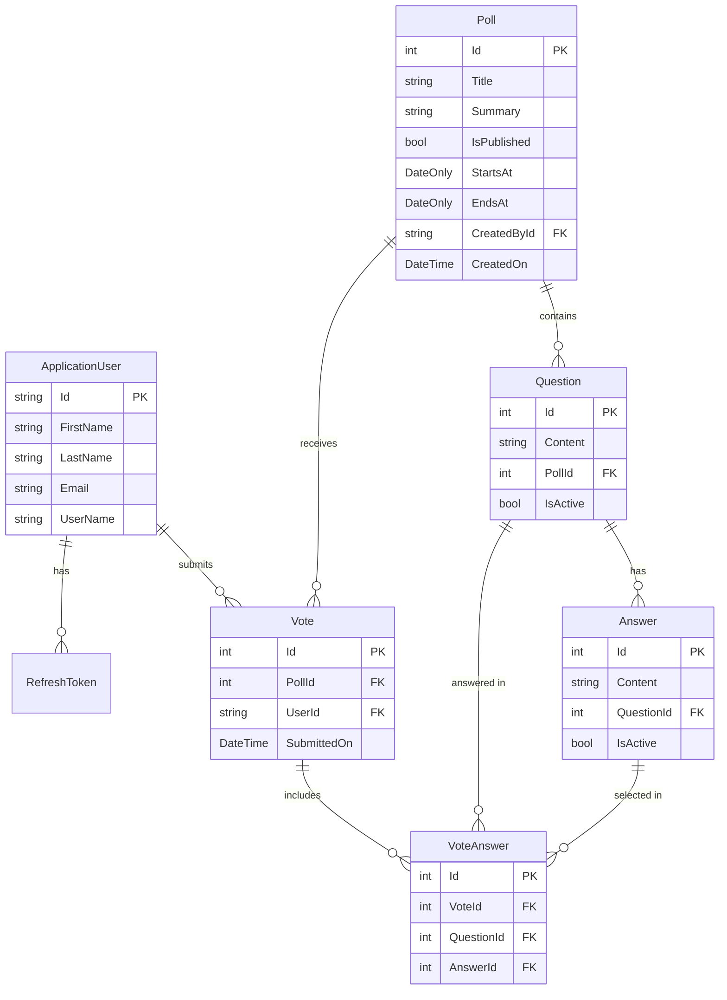

<p align="center">
  <h1 align="center">📊 SurveyBasket API</h1>
  <p align="center">
    A full-featured survey and polling REST API built with <strong>ASP.NET Core 10</strong>
    <br />
    <em>Create polls · Add questions · Collect votes · Analyze results</em>
  </p>
</p>

---

## Table of Contents

- [Overview](#overview)
- [Tech Stack](#tech-stack)
- [Architecture](#architecture)
- [Getting Started](#getting-started)
  - [Prerequisites](#prerequisites)
  - [Installation](#installation)
  - [Configuration](#configuration)
- [Background Jobs](#background-jobs)
- [API Reference](#api-reference)
  - [Authentication](#authentication)
  - [Account Management](#account-management)
  - [Polls](#polls)
  - [Questions](#questions)
  - [Voting](#voting)
  - [Results & Analytics](#results--analytics)
- [Data Models](#data-models)
- [Error Handling](#error-handling)
- [Contributing](#contributing)

---

## Overview

**SurveyBasket** is a RESTful API that allows users to create and manage surveys/polls, add questions with multiple-choice answers, collect votes from authenticated users, and retrieve analytics on the results. It features JWT-based authentication with refresh tokens, email confirmation, password recovery, account/profile management, structured error handling, hybrid caching, and Hangfire-powered background jobs for email and poll notifications.

---

## Tech Stack

| Layer               | Technology                                                   |
| ------------------- | ------------------------------------------------------------ |
| **Framework**       | ASP.NET Core 10 (.NET 10)                                    |
| **Database**        | SQL Server via Entity Framework Core 10                      |
| **Authentication**  | ASP.NET Identity + JWT Bearer Tokens                         |
| **Validation**      | FluentValidation (auto-validated via SharpGrip integration)  |
| **Object Mapping**  | Mapster                                                      |
| **Caching**         | Hybrid Cache (In-Memory + Redis via StackExchange.Redis)     |
| **Background Jobs** | Hangfire + SQL Server storage                                |
| **Email**           | MailKit                                                      |
| **Logging**         | Serilog                                                      |
| **API Docs**        | OpenAPI / Swagger UI / Scalar                                |

---

## Architecture

```
SurveyBasket/
├── Abstractions/           # Result pattern, Error type, extension methods
├── Authentication/         # JWT provider, token models & validators
├── Contracts/              # Request/Response DTOs per feature
│   ├── Answers/
│   ├── Authentication/
│   ├── Polls/
│   ├── Questions/
│   ├── Results/
│   ├── Users/
│   └── Votes/
├── Controllers/            # API endpoints
├── Entities/               # Domain models (EF Core entities)
├── Errors/                 # Domain-specific error definitions
├── Extensions/             # Claim/principal extension methods
├── Helpers/                # Email body builder utilities
├── Mapping/                # Mapster mapping configurations
├── Persistence/            # DbContext, entity configurations, migrations
├── Services/               # Business logic (interfaces + implementations)
├── Settings/               # Configuration POCOs (Mail, JWT, etc.)
├── Templates/              # Email HTML templates
├── Program.cs              # Application entry point
└── DependencyInjection.cs  # Centralized service registration
```

---

## Getting Started

### Prerequisites

- [.NET 10 SDK](https://dotnet.microsoft.com/download/dotnet/10.0)
- [SQL Server](https://www.microsoft.com/en-us/sql-server) (local or remote)
- [Redis](https://redis.io/) (optional — for distributed caching)

### Installation

```bash
# Clone the repository
git clone https://github.com/Yousry-Abdelrazek/SurveyBasket.git
cd SurveyBasket

# Restore dependencies
dotnet restore

# Apply database migrations
dotnet ef database update --project SurveyBasket

# Run the application
dotnet run --project SurveyBasket
```

### Configuration

Update `appsettings.json` (or use **User Secrets** / environment variables) with the following sections:

| Section                                  | Purpose                                      |
| ---------------------------------------- | -------------------------------------------- |
| `ConnectionStrings:DefaultConnection`    | Main SQL Server database connection string   |
| `ConnectionStrings:Redis`                | Redis connection string for distributed cache |
| `ConnectionStrings:HangfireConnection`   | SQL Server connection for Hangfire job storage |
| `Jwt`                                    | Issuer, Audience, Key, ExpiryMinutes         |
| `MailSettings`                           | SMTP host, port, credentials, sender         |
| `HangfireSettings`                       | Hangfire dashboard username and password     |
| `AllowedOrigins`                         | CORS allowed origins array                   |
| `Serilog`                                | Logging sinks & levels                       |

---

## Background Jobs

SurveyBasket uses **Hangfire** to process long-running work outside the HTTP request pipeline.

| Job Type | Trigger | Description |
| -------- | ------- | ----------- |
| Fire-and-forget email confirmation | User registration or resend confirmation request | Queues confirmation emails through `IEmailSender.SendEmailAsync` |
| Fire-and-forget password reset email | Forget password request | Queues reset password emails through `IEmailSender.SendEmailAsync` |
| Fire-and-forget poll notification | Publishing a poll that starts today | Queues a notification email for users when a new poll becomes available |
| Recurring poll notification | Daily via `Cron.Daily` | Checks for published polls starting today and sends notifications |

Hangfire is configured in `DependencyInjection.cs` with SQL Server storage using the `ConnectionStrings:HangfireConnection` value. The processing server is registered with `AddHangfireServer()`.

The Hangfire dashboard is available at:

```text
/Jobs
```

Dashboard access is protected by basic authentication using:

| Setting | Purpose |
| ------- | ------- |
| `HangfireSettings:UserName` | Dashboard username |
| `HangfireSettings:Password` | Dashboard password |

Before running background jobs locally, make sure the Hangfire SQL Server database referenced by `HangfireConnection` exists. Hangfire will create its own schema/tables inside that database on startup.

---

## API Reference

> **Base URL**: `https://localhost:{port}`  
> 🔒 = Requires a valid JWT Bearer token in the `Authorization` header.

---

### Authentication

Authentication endpoints handle user registration, login, email confirmation, password recovery, and token management.

| Method | Endpoint                                  | Description                          | Auth |
| ------ | ----------------------------------------- | ------------------------------------ | ---- |
| POST   | `/Auth`                                   | Login (get access + refresh tokens)  | ❌    |
| POST   | `/Auth/register`                          | Register a new user account          | ❌    |
| POST   | `/Auth/confirm-email`                     | Confirm user email address           | ❌    |
| POST   | `/Auth/resend-confirmation-email`         | Resend confirmation email            | ❌    |
| POST   | `/Auth/Forget-Password`                   | Send password reset email            | ❌    |
| POST   | `/Auth/Reset-Password`                    | Reset password using reset code      | ❌    |
| POST   | `/Auth/refresh`                           | Refresh an expired access token      | ❌    |
| PUT    | `/Auth/revoke-refresh-token`              | Revoke an active refresh token       | ❌    |

#### `POST /Auth` — Login

<details>
<summary>Request / Response</summary>

**Request Body:**
```json
{
  "email": "user@example.com",
  "password": "P@ssw0rd123"
}
```

**Success Response** `200 OK`:
```json
{
  "id": "user-guid",
  "email": "user@example.com",
  "firstName": "John",
  "lastName": "Doe",
  "token": "eyJhbGciOi...",
  "expiresIn": 30,
  "refreshToken": "random-refresh-token",
  "refreshTokenExpiration": "2026-05-30T00:00:00Z"
}
```

**Error Responses:** `401 Unauthorized` — Invalid credentials or unconfirmed email.

</details>

#### `POST /Auth/register` — Register

<details>
<summary>Request / Response</summary>

**Request Body:**
```json
{
  "firstName": "John",
  "lastName": "Doe",
  "email": "user@example.com",
  "password": "P@ssw0rd123"
}
```

**Success Response** `200 OK`: *(empty body — confirmation email sent)*

**Error Responses:** `409 Conflict` — Email already exists.

</details>

#### `POST /Auth/confirm-email` — Confirm Email

<details>
<summary>Request / Response</summary>

**Request Body:**
```json
{
  "userId": "user-guid",
  "code": "confirmation-code"
}
```

**Success Response** `200 OK`

**Error Responses:** `401 Unauthorized` — Invalid code. `409 Conflict` — Already confirmed.

</details>

#### `POST /Auth/resend-confirmation-email` — Resend Confirmation

<details>
<summary>Request / Response</summary>

**Request Body:**
```json
{
  "email": "user@example.com"
}
```

**Success Response** `200 OK`

</details>

#### `POST /Auth/Forget-Password` — Send Password Reset Email

<details>
<summary>Request / Response</summary>

**Request Body:**
```json
{
  "email": "user@example.com"
}
```

**Success Response** `200 OK`: *(empty body — reset password email queued if the email exists)*

This endpoint does not reveal whether the email address exists.

</details>

#### `POST /Auth/Reset-Password` — Reset Password

<details>
<summary>Request / Response</summary>

**Request Body:**
```json
{
  "email": "user@example.com",
  "newPassword": "NewP@ssw0rd123",
  "code": "password-reset-code"
}
```

**Success Response** `200 OK`

**Error Responses:** `401 Unauthorized` — Invalid reset code or unconfirmed email.

</details>

#### `POST /Auth/refresh` — Refresh Token

<details>
<summary>Request / Response</summary>

**Request Body:**
```json
{
  "token": "expired-jwt-token",
  "refreshToken": "valid-refresh-token"
}
```

**Success Response** `200 OK`: Returns a new `AuthResponse` (same shape as login).

**Error Responses:** `401 Unauthorized` — Invalid tokens.

</details>

#### `PUT /Auth/revoke-refresh-token` — Revoke Refresh Token

<details>
<summary>Request / Response</summary>

**Request Body:**
```json
{
  "token": "current-jwt-token",
  "refreshToken": "refresh-token-to-revoke"
}
```

**Success Response** `204 No Content`

**Error Responses:** `401 Unauthorized` — Invalid tokens.

</details>

---

### Account Management

Account endpoints let an authenticated user read and update their own profile and change their password.

| Method | Endpoint                  | Description                         | Auth |
| ------ | ------------------------- | ----------------------------------- | ---- |
| GET    | `/me`                     | Get current user profile            | 🔒   |
| PUT    | `/me/update-profile`      | Update current user profile         | 🔒   |
| PUT    | `/me/change-pass`         | Change current user password        | 🔒   |

#### `GET /me` — Get User Profile

<details>
<summary>Response</summary>

**Success Response** `200 OK`:
```json
{
  "email": "user@example.com",
  "userName": "user@example.com",
  "firstName": "John",
  "lastName": "Doe"
}
```

**Error Responses:** `401 Unauthorized` — Missing or invalid JWT Bearer token.

</details>

#### `PUT /me/update-profile` — Update User Profile

<details>
<summary>Request / Response</summary>

**Request Body:**
```json
{
  "firstName": "John",
  "lastName": "Doe"
}
```

**Success Response** `204 No Content`

**Error Responses:** `400 Bad Request` — Validation error. `401 Unauthorized` — Missing or invalid JWT Bearer token.

</details>

#### `PUT /me/change-pass` — Change Password

<details>
<summary>Request / Response</summary>

**Request Body:**
```json
{
  "currentPassword": "P@ssw0rd123",
  "newPassword": "NewP@ssw0rd123"
}
```

**Success Response** `204 No Content`

**Error Responses:** `400 Bad Request` — Invalid current password or password validation error. `401 Unauthorized` — Missing or invalid JWT Bearer token.

</details>

---

### Polls

Manage surveys/polls. All endpoints require authentication.

| Method | Endpoint                              | Description                        | Auth |
| ------ | ------------------------------------- | ---------------------------------- | ---- |
| GET    | `/api/Polls`                          | Get all polls                      | 🔒   |
| GET    | `/api/Polls/current`                  | Get currently active polls         | 🔒   |
| GET    | `/api/Polls/{id}`                     | Get a specific poll by ID          | 🔒   |
| POST   | `/api/Polls`                          | Create a new poll                  | 🔒   |
| PUT    | `/api/Polls/{id}`                     | Update an existing poll            | 🔒   |
| DELETE | `/api/Polls/{id}`                     | Delete a poll                      | 🔒   |
| PUT    | `/api/Polls/{id}/toggle-publish`      | Toggle poll publish status         | 🔒   |

#### `POST /api/Polls` — Create Poll

<details>
<summary>Request / Response</summary>

**Request Body:**
```json
{
  "title": "Customer Satisfaction Q1 2026",
  "summary": "Quarterly customer feedback survey",
  "startsAt": "2026-01-01",
  "endsAt": "2026-03-31"
}
```

**Success Response** `201 Created`:
```json
{
  "id": 1,
  "title": "Customer Satisfaction Q1 2026",
  "summary": "Quarterly customer feedback survey",
  "isPublished": false,
  "startsAt": "2026-01-01",
  "endsAt": "2026-03-31"
}
```

**Error Responses:** `409 Conflict` — Poll with same title already exists.

</details>

#### `GET /api/Polls/{id}` — Get Poll

<details>
<summary>Response</summary>

**Success Response** `200 OK`:
```json
{
  "id": 1,
  "title": "Customer Satisfaction Q1 2026",
  "summary": "Quarterly customer feedback survey",
  "isPublished": true,
  "startsAt": "2026-01-01",
  "endsAt": "2026-03-31"
}
```

**Error Responses:** `404 Not Found` — Poll not found.

</details>

#### `PUT /api/Polls/{id}` — Update Poll

<details>
<summary>Request / Response</summary>

**Request Body:** Same shape as Create Poll request.

**Success Response** `204 No Content`

**Error Responses:** `404 Not Found` — Poll not found. `409 Conflict` — Duplicate title.

</details>

#### `PUT /api/Polls/{id}/toggle-publish` — Toggle Publish Status

<details>
<summary>Response</summary>

**Success Response** `204 No Content`

**Error Responses:** `404 Not Found` — Poll not found.

</details>

---

### Questions

Manage questions within a poll. All endpoints are nested under a poll.

| Method | Endpoint                                             | Description                             | Auth |
| ------ | ---------------------------------------------------- | --------------------------------------- | ---- |
| GET    | `/api/polls/{pollId}/Questions`                      | Get all questions for a poll            | 🔒   |
| GET    | `/api/polls/{pollId}/Questions/{id}`                 | Get a specific question                 | 🔒   |
| POST   | `/api/polls/{pollId}/Questions`                      | Add a new question with answers         | 🔒   |
| PUT    | `/api/polls/{pollId}/Questions/{id}`                 | Update a question and its answers       | 🔒   |
| PUT    | `/api/polls/{pollId}/Questions/{id}/toggle-status`   | Toggle question active status           | 🔒   |

#### `POST /api/polls/{pollId}/Questions` — Add Question

<details>
<summary>Request / Response</summary>

**Request Body:**
```json
{
  "content": "How would you rate our service?",
  "answers": [
    "Excellent",
    "Good",
    "Average",
    "Poor"
  ]
}
```

**Success Response** `201 Created`:
```json
{
  "id": 1,
  "content": "How would you rate our service?",
  "answers": [
    { "id": 1, "content": "Excellent" },
    { "id": 2, "content": "Good" },
    { "id": 3, "content": "Average" },
    { "id": 4, "content": "Poor" }
  ]
}
```

**Error Responses:**  
- `404 Not Found` — Poll not found.  
- `409 Conflict` — Duplicate question content.

</details>

---

### Voting

Submit and start votes on a poll. All endpoints require authentication and are user-scoped.

| Method | Endpoint                              | Description                               | Auth |
| ------ | ------------------------------------- | ----------------------------------------- | ---- |
| GET    | `/api/polls/{pollId}/vote`            | Start voting — get available questions     | 🔒   |
| POST   | `/api/polls/{pollId}/vote`            | Submit a vote with answers                 | 🔒   |

#### `GET /api/polls/{pollId}/vote` — Start Voting

<details>
<summary>Response</summary>

**Success Response** `200 OK`: Returns an array of questions with their answers for the user to fill out.
```json
[
  {
    "id": 1,
    "content": "How would you rate our service?",
    "answers": [
      { "id": 1, "content": "Excellent" },
      { "id": 2, "content": "Good" },
      { "id": 3, "content": "Average" },
      { "id": 4, "content": "Poor" }
    ]
  }
]
```

**Error Responses:** `404 Not Found` — Poll not found.

</details>

#### `POST /api/polls/{pollId}/vote` — Submit Vote

<details>
<summary>Request / Response</summary>

**Request Body:**
```json
{
  "answers": [
    { "questionId": 1, "answerId": 2 },
    { "questionId": 2, "answerId": 5 }
  ]
}
```

**Success Response** `204 No Content`

**Error Responses:**  
- `409 Conflict` — User already voted on this poll.  
- `400 Bad Request` — Invalid questions submitted.

</details>

---

### Results & Analytics

Retrieve analytics and raw voting data for a poll. All endpoints require authentication.

| Method | Endpoint                                           | Description                                    | Auth |
| ------ | -------------------------------------------------- | ---------------------------------------------- | ---- |
| GET    | `/api/polls/{pollId}/Results/row-data`             | Get raw vote data (voter, date, answers)       | 🔒   |
| GET    | `/api/polls/{pollId}/Results/votes-per-day`        | Get vote count grouped by day                  | 🔒   |
| GET    | `/api/polls/{pollId}/Results/votes-per-question`   | Get vote count grouped by question & answer    | 🔒   |

#### `GET /api/polls/{pollId}/Results/row-data` — Raw Vote Data

<details>
<summary>Response</summary>

**Success Response** `200 OK`:
```json
{
  "title": "Customer Satisfaction Q1 2026",
  "votes": [
    {
      "voteName": "John Doe",
      "voteDate": "2026-02-15T10:30:00Z",
      "selectedAnswers": [
        { "question": "How would you rate our service?", "answer": "Excellent" }
      ]
    }
  ]
}
```

</details>

#### `GET /api/polls/{pollId}/Results/votes-per-day` — Votes Per Day

<details>
<summary>Response</summary>

**Success Response** `200 OK`:
```json
[
  { "date": "2026-02-15", "numberOfVotes": 42 },
  { "date": "2026-02-16", "numberOfVotes": 38 }
]
```

</details>

#### `GET /api/polls/{pollId}/Results/votes-per-question` — Votes Per Question

<details>
<summary>Response</summary>

**Success Response** `200 OK`:
```json
[
  {
    "question": "How would you rate our service?",
    "selectedAnswers": [
      { "answer": "Excellent", "count": 25 },
      { "answer": "Good", "count": 18 },
      { "answer": "Average", "count": 10 },
      { "answer": "Poor", "count": 3 }
    ]
  }
]
```

</details>

---

## Data Models

### Entity Relationship Diagram



---

## Error Handling

All errors follow the **RFC 7807 Problem Details** format via ASP.NET Core's `ProblemDetails`:

```json
{
  "type": "https://tools.ietf.org/html/rfc7807",
  "title": "Poll.NotFound",
  "detail": "No Poll Was Found with the given Id!",
  "status": 404
}
```

### Defined Error Codes

| Code                           | HTTP Status | Description                                    |
| ------------------------------ | ----------- | ---------------------------------------------- |
| `User.InvalidCredentials`      | 401         | Invalid email or password                      |
| `User.InvalidTokens`           | 401         | Invalid access or refresh token                |
| `User.InvalidRefreshToken`     | 401         | Invalid refresh token                          |
| `User.DuplicatedEmail`         | 409         | Email already registered                       |
| `User.EmailNotConfirmed`       | 401         | Email not yet confirmed                        |
| `User.InvalidCode`             | 401         | Invalid email confirmation or password reset code |
| `User.DuplicatedEmailConfirmation` | 409     | Email already confirmed                        |
| `PasswordMismatch`             | 400         | Current password is incorrect                  |
| `InvalidToken`                 | 401         | Password reset token is invalid                |
| `Poll.NotFound`                | 404         | Poll not found                                 |
| `Poll.AlreadyExists`           | 409         | Duplicate poll title                           |
| `Question.NotFound`            | 404         | Question not found                             |
| `Question.AlreadyExists`       | 409         | Duplicate question content in the same poll    |
| `Vote.AlreadyExists`           | 409         | User already voted on this poll                |
| `Vote.InvalidQuestion`         | 400         | Submitted questions are invalid                |

---

## Contributing

1. **Fork** the repository
2. **Create** your feature branch (`git checkout -b feature/amazing-feature`)
3. **Commit** your changes (`git commit -m 'Add some amazing feature'`)
4. **Push** to the branch (`git push origin feature/amazing-feature`)
5. **Open** a Pull Request

### Adding a New Feature Endpoint

When you add a new feature to the project, update this README by following the scalable pattern:

1. **Add a new section** under [API Reference](#api-reference) with the feature name as heading
2. **Add the endpoint summary table** listing Method, Endpoint, Description, and Auth
3. **Add collapsible details** for each endpoint with Request/Response examples
4. **Update the Entity Relationship Diagram** if new entities are introduced
5. **Add error codes** to the [Error Handling](#error-handling) table if new errors are defined

---

<p align="center">
  Built with ❤️ using ASP.NET Core 10
</p>
